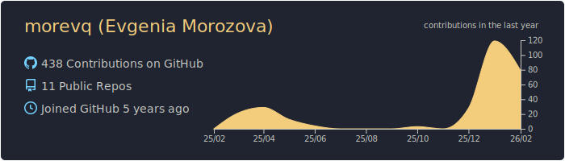
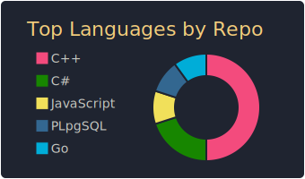

## Hi there, I’m Zhenya 👋
I’m a junior backend developer with experience in team leadership, product development,  
and educational IT projects. I enjoy building reliable backend systems and taking responsibility  
from idea to delivery.

---

### ✨ About me
- 💻 Backend developer focused on **C++**
- 🎓 Bachelor student at **RTU MIREA**
- 👩‍🏫 Experience teaching **C++** and **Computer Networks**
- 🌍 Based in Moscow, open to remote opportunities
---

### 🛠 Tech stack
- **Languages:** C++, Go  
- **Backend:** REST API (Crow), PostgreSQL, MongoDB  
- **Tools:** CMake, vcpkg, Docker, Git  
- **Other:** SQL, noSQL (Redis, MongoDB), CLI tools
  
---

### 🚀 Experience & programs
**C++ Instructor — Moscow School of Programmers (2024–2026)**  
- Weekly classes on C++ and computer networks  
- Mentored student teams during hackathons  

**Team Manager — WASP Academy (Volunteer, 2021–2023)**  
- Led weekly project meetings with student teams  
- Supported project planning and development processes  

**Education & Programs**
- RTU MIREA — Bachelor’s Degree (2023–2027)  
- Moscow School of Programmers — C++ track  
- Microsoft Learn Student Ambassadors Academy  
- CROC Leadership Program  

---

### ❄️ Outside of code
- Reached Elbrus saddle (5,300 m out of 5,642 m) — resilience and long-term goal focus  
- Snowboarding, traveling, and exploring new technologies  

---

### ✨ Connect with me
- 💬 Telegram: https://t.me/morevq
- 📧 Email: morevq05@gmail.com  

---

### 📊 GitHub stats

| | |
|---|---|
|  |  |

